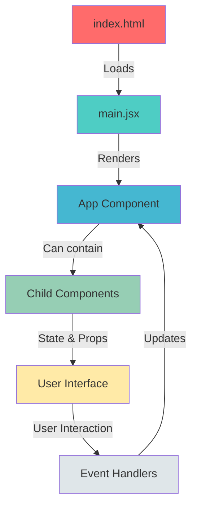
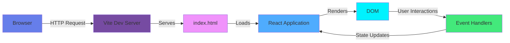
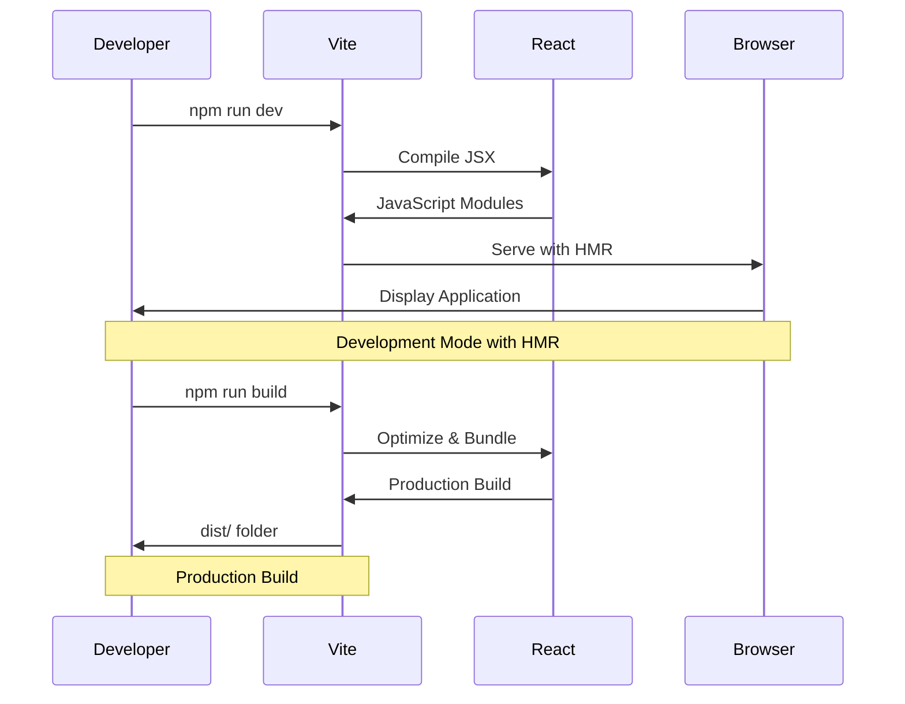
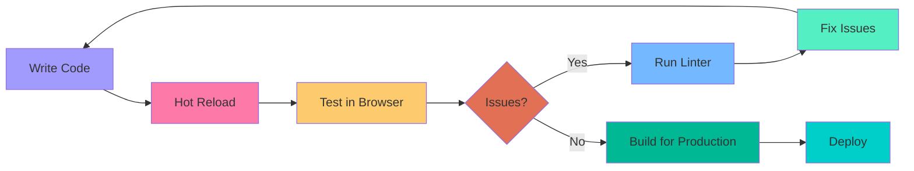

<div align="center">

# 🚀 React Vite Project

[](https://reactjs.org/)
[](https://vitejs.dev/)
[](LICENSE)
[](https://nodejs.org/)


**A modern, fast, and efficient React application built with Vite**

[Features](#-features) •
[Installation](#-installation) •
[Usage](#-usage) •
[Architecture](#-architecture) •
[Contributing](#-contributing)

---

</div>

## 📋 Table of Contents

- [Overview](#-overview)
- [Features](#-features)
- [Technology Stack](#-technology-stack)
- [Installation](#-installation)
- [Usage](#-usage)
- [Project Structure](#-project-structure)
- [Architecture](#-architecture)
- [Development Workflow](#-development-workflow)
- [Scripts](#-scripts)
- [Contributing](#-contributing)
- [License](#-license)
- [Contact](#-contact)

## 🌟 Overview

This project is a modern React application bootstrapped with Vite, providing lightning-fast development experience with Hot Module Replacement (HMR) and optimized build performance. The application is designed with best practices in mind, featuring a clean architecture and modular component structure.

### Why This Project?

- ⚡ **Lightning Fast**: Vite's native ES modules provide instant server start and fast HMR
- 🎯 **Modern Stack**: Built with the latest React 19 and cutting-edge tooling
- 🔧 **Developer Friendly**: ESLint integration for code quality and consistency
- 📦 **Optimized Builds**: Production-ready builds with optimal chunking and tree-shaking
- 🚀 **Quick Start**: Get up and running in minutes with minimal configuration

## ✨ Features

- 🎨 **Modern UI Components**: Built with React functional components and hooks
- ⚡ **Hot Module Replacement**: Instant feedback during development
- 🔍 **ESLint Integration**: Automated code quality checks and formatting
- 📱 **Responsive Design**: Mobile-first approach for all screen sizes
- 🎯 **Type Safety Ready**: Easy to integrate TypeScript support
- 🔧 **Extensible**: Modular architecture for easy feature additions
- 🚀 **Production Ready**: Optimized builds for deployment
- 📦 **Zero Config**: Works out of the box with sensible defaults

## 🛠️ Technology Stack

<div align="center">

| Technology | Description |
|------------|-------------|
|  | UI Library for building user interfaces |
|  | Next generation frontend tooling |
|  | Linting utility for JavaScript |
|  | Programming language |

</div>

## 📦 Installation

### Prerequisites

Before you begin, ensure you have the following installed:
- **Node.js** (v18.0.0 or higher)
- **npm** (v9.0.0 or higher) or **yarn** (v1.22.0 or higher)

### Steps

1. **Clone the repository**
   ```bash
   git clone https://github.com/ZainulabdeenOfficial/react.git
   cd react
   ```

2. **Navigate to the project directory**
   ```bash
   cd appproject1
   ```

3. **Install dependencies**
   ```bash
   npm install
   # or
   yarn install
   ```

4. **Start the development server**
   ```bash
   npm run dev
   # or
   yarn dev
   ```

5. **Open your browser**
   
   Navigate to `http://localhost:5173` to see the application running.

## 🚀 Usage

### Development Mode

Start the development server with hot reload:

```bash
npm run dev
```

The application will be available at `http://localhost:5173`.

### Build for Production

Create an optimized production build:

```bash
npm run build
```

The build output will be in the `dist` directory.

### Preview Production Build

Preview the production build locally:

```bash
npm run preview
```

### Linting

Run ESLint to check code quality:

```bash
npm run lint
```

## 📁 Project Structure

```
react/
├── appproject1/
│   ├── src/
│   │   ├── main.jsx          # Application entry point
│   │   └── App.jsx           # Main App component
│   ├── public/               # Static assets
│   ├── index.html           # HTML template
│   ├── vite.config.js       # Vite configuration
│   ├── eslint.config.js     # ESLint configuration
│   └── package.json         # Project dependencies
├── LICENSE                  # MIT License
└── README.md               # Project documentation
```

### Directory Breakdown

- **`src/`**: Contains all source code files
  - **`main.jsx`**: Entry point that renders the React app
  - **`App.jsx`**: Root component of the application
- **`public/`**: Static assets that are served as-is
- **`index.html`**: Main HTML file that loads the React app
- **Configuration Files**: Vite and ESLint configurations for the build process

## 🏗️ Architecture

### Component Flow Diagram



### Application Architecture



### Build Process



## 🔄 Development Workflow



## 📜 Scripts

| Command | Description |
|---------|-------------|
| `npm run dev` | Start development server with HMR |
| `npm run build` | Build for production |
| `npm run preview` | Preview production build locally |
| `npm run lint` | Run ESLint for code quality checks |

## 🤝 Contributing

Contributions are welcome! Please follow these steps:

1. **Fork the repository**
2. **Create a feature branch**
   ```bash
   git checkout -b feature/AmazingFeature
   ```
3. **Commit your changes**
   ```bash
   git commit -m 'Add some AmazingFeature'
   ```
4. **Push to the branch**
   ```bash
   git push origin feature/AmazingFeature
   ```
5. **Open a Pull Request**

### Code Style Guidelines

- Follow ESLint rules defined in the project
- Write clean, readable, and maintainable code
- Comment complex logic when necessary
- Keep components small and focused

## 📄 License

This project is licensed under the MIT License - see the [LICENSE](LICENSE) file for details.

```
MIT License

Copyright (c) 2026 M Zain Ul Abideen

Permission is hereby granted, free of charge, to any person obtaining a copy
of this software and associated documentation files (the "Software"), to deal
in the Software without restriction, including without limitation the rights
to use, copy, modify, merge, publish, distribute, sublicense, and/or sell
copies of the Software, and to permit persons to whom the Software is
furnished to do so, subject to the following conditions:

The above copyright notice and this permission notice shall be included in all
copies or substantial portions of the Software.
```

## 📧 Contact

**M Zain Ul Abideen**

- GitHub: [@ZainulabdeenOfficial](https://github.com/ZainulabdeenOfficial)
- Project Link: [https://github.com/ZainulabdeenOfficial/react](https://github.com/ZainulabdeenOfficial/react)

## 🙏 Acknowledgments

- [React Team](https://reactjs.org/) - For the amazing React library
- [Vite Team](https://vitejs.dev/) - For the blazing fast build tool
- [ESLint](https://eslint.org/) - For helping maintain code quality
- [Shields.io](https://shields.io/) - For the awesome badges
- [Mermaid](https://mermaid.js.org/) - For beautiful diagrams

---

<div align="center">

**⭐ If you find this project useful, please consider giving it a star! ⭐**

Made with ❤️ by [M Zain Ul Abideen](https://github.com/ZainulabdeenOfficial)

 M Zain Ul Abideen

</div>
